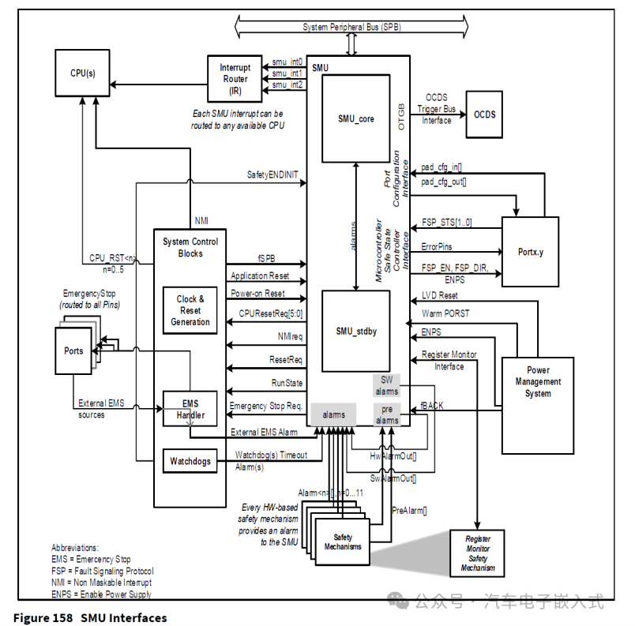
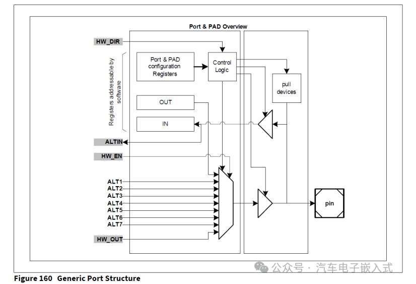
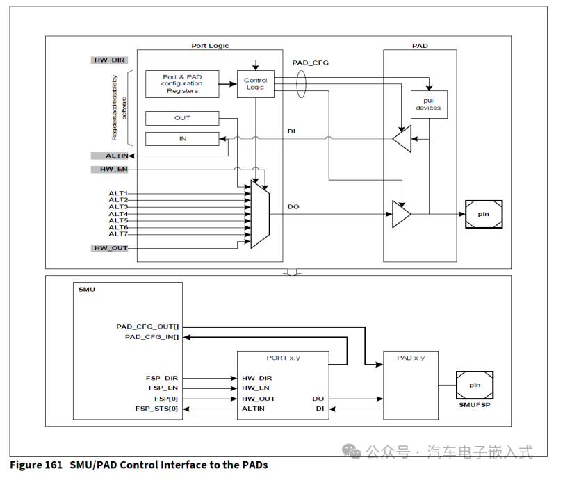
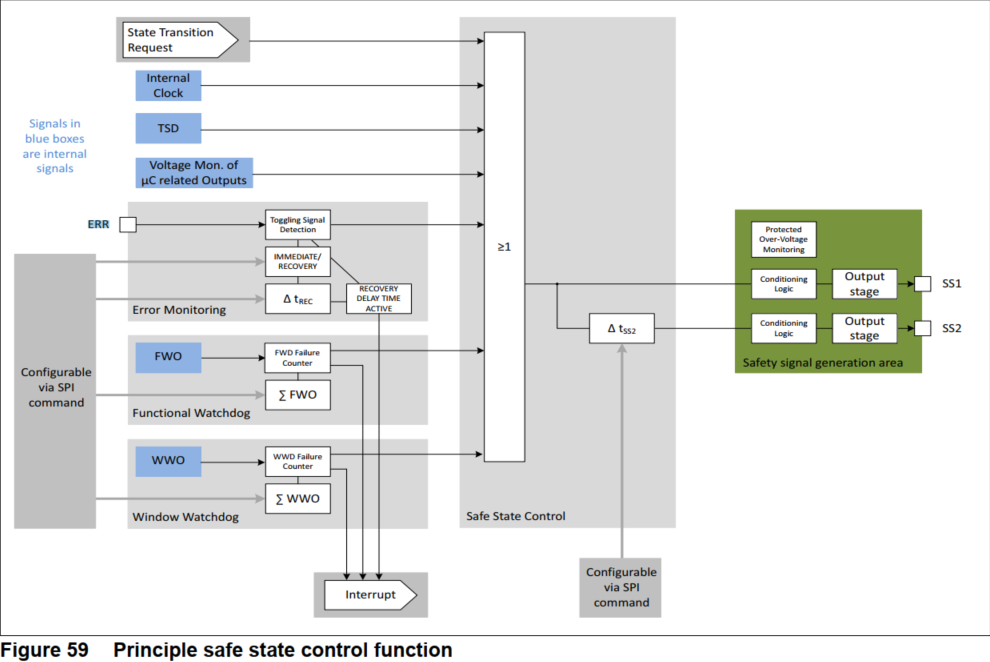
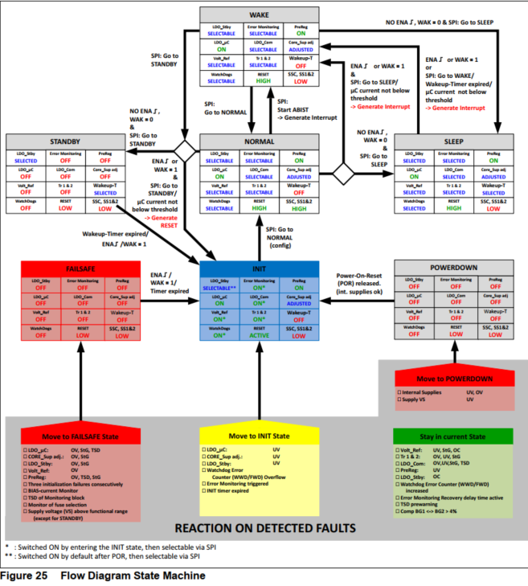
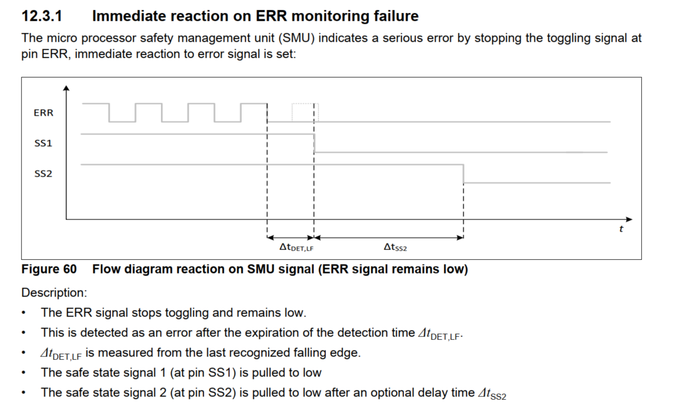
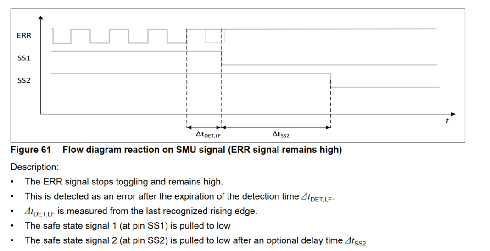
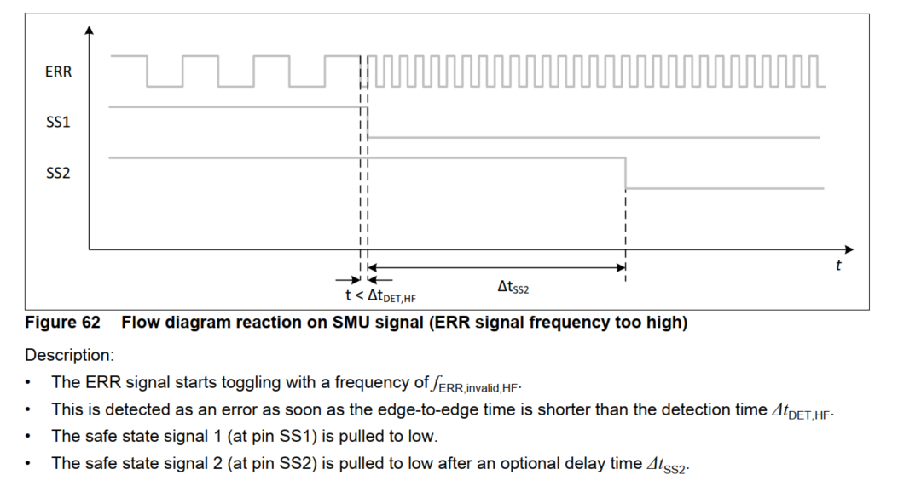

# Safty Management Unit (SMU)
## 功能概述
    SMU模块是Aurix芯片自带的一个功能安全硬件模块，它能够收集其他模块（PMS, MTU, SCU, CCU, e.g.）由于硬件功能安全机制产生的报警（Alarm），然后，SMU模块通过用户配置能够产生内部或者外部的动作/响应，也可以不产生任何动作。  
SMU 是安全架构的核心组件，提供通用接口，用于管理存在故障的微控制器的行为。SMU 集中所有与不同的硬件和软件安全机制相关的警报信号。每个警报都可以单独配置为触发内部操作和 / 或通过故障信号协议（FSP, Fault Signaling Protocol）向外部通知存在故障。 每一报警的严重程度应根据安全应用的需要进行配置：默认情况下，除看门狗超时报警外，每一报警反应都被禁用。 为了进行调试和诊断，报警信号设置了一个粘滞位（sticky bit），该粘滞位可适应应用程序或系统重置。 SMU 还实施了一些与专用安全机制的管理和测试相关的内务管理（housekeeping functions）功能。 可以使用特殊测试模式测试 SMU 本身，以检测潜在故障。除了寄存器访问保护外， SMU 还实施了配置锁定机制（configuration locking mechanism）。

## 组成
. SMU_core: 位于core domain.  
. SMU_stdby: 位于stand-by domain.

### 从SMU_core到Ports（ErrorPin）的接口
端口引脚（Port Pin）可以通过 ALTx 输出线路连接到外围设备。这是开机重置后端口的默认状态 。SMU_CORE 使用 HW_DIR ， AlTIN ， HW_EN ， HW_OUT 信号连接到端口。当 HW_EN 端口输入由 SMU_CORE 驱动时， SMU_CORE 将完全控制该端口，绕过与 ALTx 输入使用相关的任何其他软件配置。

下图提供了端口结构的更详细概述，并突出显示了SMU_CORE连接中涉及的信号

### 故障信号协议 (Fault Signaling Protocol, FSP)
    故障信号协议使微控制器能够向外部安全控制器设备报告紧急情况，以控制安全系统的安全状态。

故障信号协议通过 FSP 命令寄存器进行配置。FSP 状态由 STS 寄存器中的 FSP 标志指示。FSP有三种状态：  
•开机重置状态。在热启动重置（warm power-on reset）后， SMU 与端口断开连接 (请参阅 SMU_CORE Integration Guidelines)。在热启动重置后， SMU FSP 输出应为故障状态。  
•无故障状态。无故障状态由一个定时器控制，定时器被称为 TFSP_FFS ，并由 FSP 寄存器控制。  
•故障状态。故障状态的时间由 FSP 寄存器控制。最小活动故障状态时间称为 TFSP_FS。
无故障和故障状态行为可以使用以下协议进行配置：  
. Bi-stable protocol (default)  
. Dynamic dual-rail protocol  
. Time-switching protocol  
FSP 可通过以下方式控制：  
. 软件方式，通过CMD寄存器使用SMU_ActivateFSP()和SMU_ReleaseFSP()命令。  
. 硬件方式，通过AGiFSP(I = 0-11)配置寄存器。  

### 参考链接
[CSDN TC3xx SMU模块](https://blog.csdn.net/qq_36056498/article/details/136136088)

# TLF35584的应用
## 通过引脚图可以得到，FSP接口接的是TLE35584的ERR引脚，由TLE35584手册可得以下特性：
### 1
在引脚ERR的信号正常情况下是一个有着特定频率的切换信号，永久的低或高信号将被检测为错误。永久低表示可能存在一些internal fault，永久高可能是电路短路的原因。
### 2
SPI状态转换请求。在满足其他边界条件的情况下，有效的GoToNORMAL命令触发信号SS1/2切换到高电平。通过SPI命令将设备移出NORMAL状态，将信号SS1和2（可选地由tSS2延迟）切换到低电平.

## 错误类型

### 1 Stay in current State 下面的失败不会触发设备移动到另一个状态，但会通过中断事件指示 失败：
•检测欠压或短路接地或过载检测在电压基准  
•跟踪器1或2的过压，欠压或短路接地检测  
•检测过压，欠压，短地或热停机在LDO_Com  
•检测低压在预调节器。  
•在备用调节器检测过载  
•增加窗口/功能看门狗状态计数器，但实际值仍然低于阈值  
•错误监控恢复延迟时间是活动的，ERR信号停止切换  
•热停机预警（降压预调节器或/和LDO_µC或/和LDO_Com）  
•带隙监控：两个带隙的偏差大于4%  
### 2 Transition into INIT State 以下故障将使设备从任何状态变为init状态：
•在LDO_µC， Core_Sup或LDO_Stby下检测欠压  
•检测窗口/功能看门狗状态计数器溢出  
•停止错误信号检测（即时反应模式）或停止或错误信号检测超过恢复延迟时间（恢复模式）  
•INIT定时器连续一次或两次过期（INIT状态配置失败）  
### 3 Transition into FAILSAFE State 以下故障将使设备从任何状态变为failsafe状态：
•在LDO_µC下检测过电压，短接地或热关闭  
•Core_Sup或LDO_Stby的过电压或短地检测  
•在电压基准处检测过电压  
•检测过电压，短接地（仅在启动阶段在INIT状态）或热关闭在预调节器  
•连续三次初始化失败(例如：在INIT状态下配置失败)  
•BIAS电流监视器故障  
•由于监控块温度过高而导致的超温停机。  
•保险丝选择监视器故障  
•电源引脚处的过电压（VS）将触发过压保护并将设备移动到
FAILSAFE-state （STANDBY除外）  
### 4 Transition into POWERDOWN-state 以下故障/事件将使设备始终处于最高优先级的powerdown状态：
•Vvs低于Vpd,io,min，减小时最小  
•检测过压或欠压在内部电源  

## 表现
### 1
SMU通过在引脚ERR处停止切换信号来指示严重错误，设置对错误信号的立即反应。
### 2
立即反应或恢复延迟反应，仅与输入信号ERR有关：该参数决定安全状态控制是立即对SMU指示的错误作出反应，还是在错误指示仍然存在的情况下在一定延迟后作出反应。在恢复延迟反应中，安全状态控制将产生中断，并开始编程的恢复延迟时间。如果在此时间内错误应该消失（意味着错误信号应该再次切换，在恢复延迟时间结束之前），安全状态控制将保持安全状态输出SS1/2高。如果在此时间内错误信号不消失并保持错误指示（即在恢复延迟时间结束前错误信号不再次切换），则安全状态控制器将在恢复延迟时间结束后激活安全状态信号SS1和SS2。即时反应是指信号检测延迟时间后的反应。

## 实例

...

